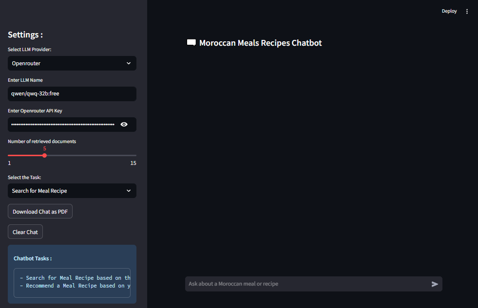
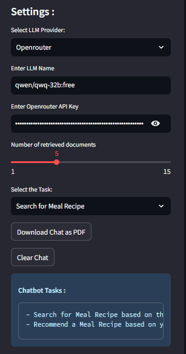
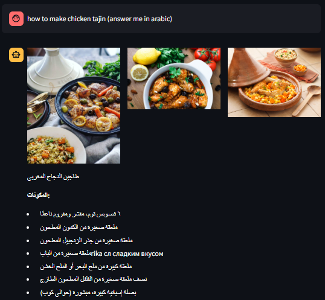
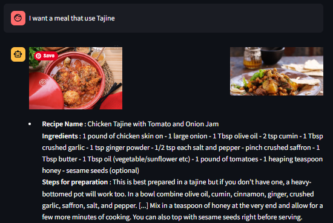
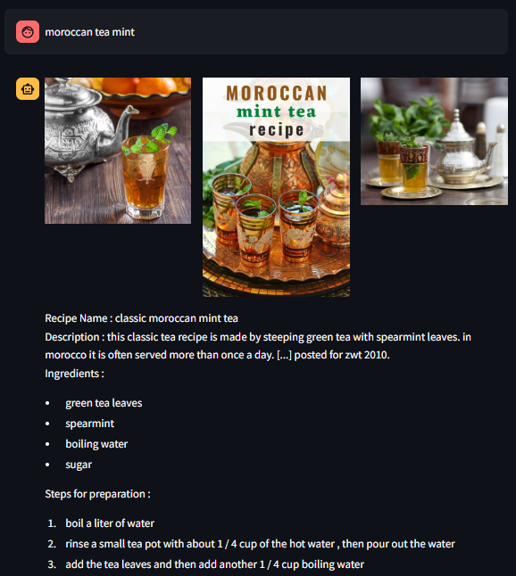
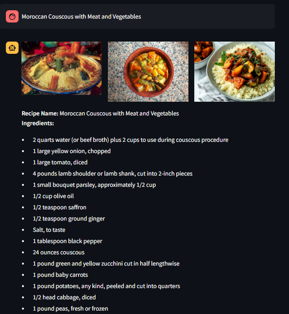
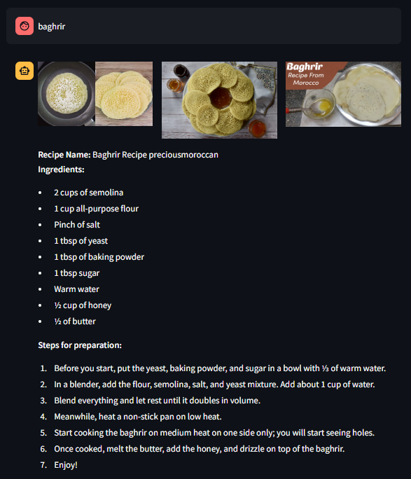
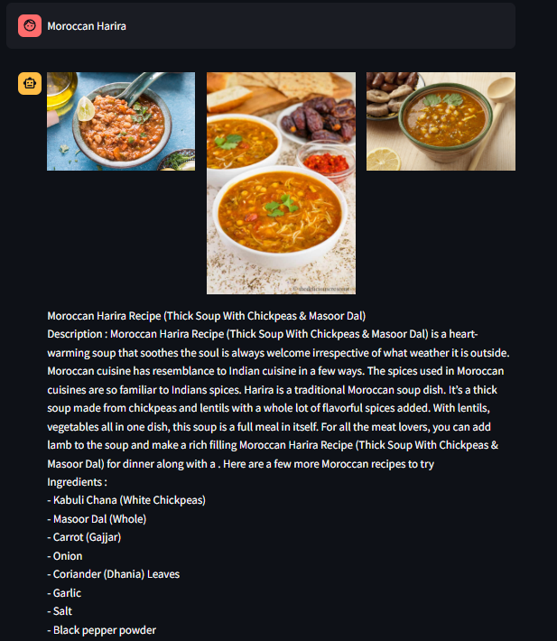
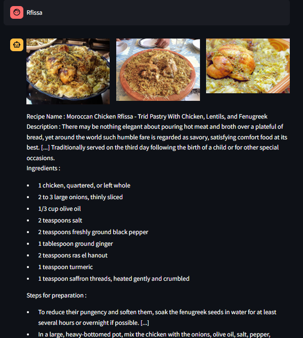

# 🥘 Moroccan Meal Recipes Chatbot 🍗

An AI-powered chatbot designed to provide authentic Moroccan recipes using **Retrieval-Augmented Generation (RAG)**. Users can ask about any Moroccan dish, and the chatbot responds with the **recipe name**, **description**, **ingredients**, **preparation steps**, and even **images** (if you're connected to the internet).
Also the user can choose to search or recommed a recipe based on their ingredients.

You can choose your preferred **LLM provider**:
- 🧠 **Ollama** (Local inference)
- 🌐 **OpenRouter** (API-based inference)

---

## ✨ Features

- 🔍 **RAG-powered Retrieval**: Combines local/remote LLMs with vector-based document search to find the most relevant recipe.
- 👨‍🍳 **Authentic Recipe Info**: Get detailed info including ingredients, instructions, and cultural context.
- 🌐 **Dual LLM Support**: Choose between Ollama (offline) or OpenRouter (online).
- 🖼️ **Dynamic Meal Images**: If internet access is available, the chatbot fetches related images.
- 💬 **Interactive Chat Interface**: Friendly UI for conversational recipe discovery.
- 🔐 **Secure API key handling** via `.env`.

---

## 📁 Project Structure

The project is organized as follows:

```markdown
├── .env                        # Environment variables (store OPENROUTER_API_KEY here)
├── .gitignore                  # Git ignore rules
├── README.md                   # Project documentation
├── app.py                      # Main entry point for chatbot UI
├── rag.py                      # RAG pipeline: document retrieval + LLM generation
├── Moroccan_Recipes_FaissDB/   # Faiss vector database Contains Moroccan recipes
├── imgs/                       # Folder for images and UI screenshots
├── Data_Preparation_Notebooks/ # Notebooks for data preparation and vector DB setup (recipe documents / embeddings)
```

---

## ⚙️ Installation & Setup

### 1. 📦 Clone the repository
```bash
git clone git@github.com:drisskhattabi6/Moroccan-Meal-Recipes-Chatbot.git
cd Moroccan-Meal-Recipes-Chatbot
```

### 2. 🧪 Create and activate a virtual environment (optional but recommended)
```bash
python -m venv venv
source venv/bin/activate   # On Windows: venv\Scripts\activate
```

### 3. 🛠️ Install dependencies
```bash
pip install -r requirements.txt
```

### 4. 🔑 Setup OpenRouter (if using cloud LLM)
- Get your API key from [OpenRouter.ai](https://openrouter.ai)
- Create a `.env` file and add your key:
```
OPENROUTER_API_KEY='your_api_key_here'
```

### 5. 🧠 Install Ollama (for local LLM)
- Follow instructions at: https://ollama.com/download
- Pull a model:
```bash
ollama pull llama3.2-vision:latest
```

---

## 🚀 Usage

Start the app:

```bash
streamlit run app.py
```

- Select the **LLM provider**: Ollama or OpenRouter
- Ask: _"How do I make couscous?"_
- Get a beautifully formatted response including:
  - 🖼️ dish image
  - 🍛 Recipe name and description
  - 📜 Ingredients list
  - 📝 Step-by-step instructions

---

## 📸 Screenshots



















---

## 📌 Notes

- Internet connection is required **only** for image fetching and OpenRouter usage.
- All recipe data is stored and retrieved locally for fast, reliable results.
